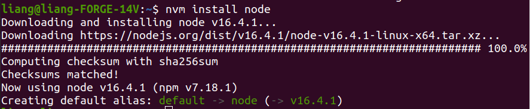
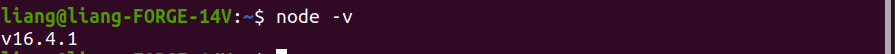

# 安裝node.js

安裝教學 https://titangene.github.io/article/nvm.html

## 安裝 nvm (node version manager) node 版本管理器。

```
wget -qO- https://raw.githubusercontent.com/nvm-sh/nvm/v0.34.0/install.sh | bash
```

上面的指令執行完畢後，重新開啟Terminal。

查看nvm的版本

```
nvm --version
```

如果安裝成功，會顯示版本號碼。若失敗，請參考教學文的內容。


## 用nvm安裝node.js。

安裝最新版本的node.js

```
nvm install node
```

安裝成功的畫面如下。我當時安裝的版本是node 16.4.1。




查看已安裝的node版本

```
node -v
```




### 其他可能會用到的指令

安裝指定版本的node，直接加上版本號碼即可。例如：

```
nvm install 8.9.1
```


查看可安裝的node版本(這個會列出超多)

```
nvm ls-remote
```

只查看長期版本(LTS)

```
nvm ls-remote --lts
```


查看已經安裝的版笨

```
nvm ls
```


查看目前使用的版本

```
nvm current
```


切換使用的node版本（小提示，可以用tab補齊版本號）

```
nvm use v14.17.2
```