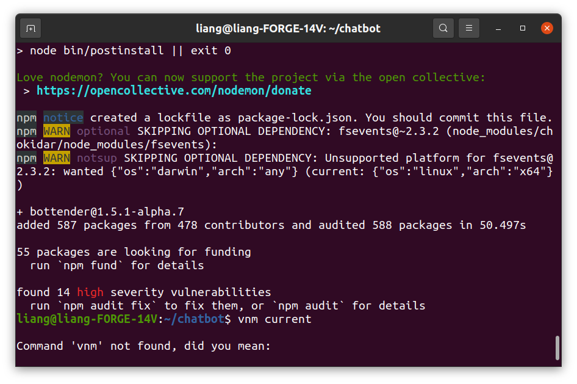
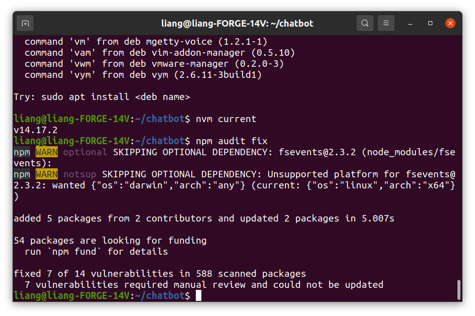
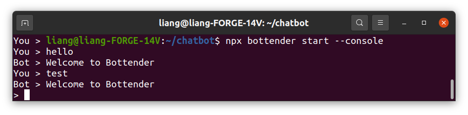
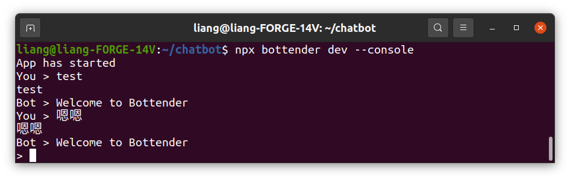

# 創建Bottender專案

## 建立GitHub repository

https://github.com/jcliang7/chatbot.git

* 小意外：收到GitHub的mail通知，2021/08/13之後，不接受密碼登錄。
* 忘記用git ignore了，套件全部傳上去了。

### 我用的node版本是 v14.17.2

### Terminal 出現需要fix的文字



所以我下了指令fix

```
npm audit fix
```

還是有警告，先不管它。



### 加入 bottender.config.js 設定檔

### 加入 index.js進入點

## 啟動

### 正式模式

```
npx bottneder start --console
```

Ternimal 就變成我跟chatBot的聊天視窗了。我可以輸入文字，目前chatBot 只會回應 "Welcome to Bottender"。



  輸入Ctrl+C可以終止chatBot

### 開發模式

```
npx bottender dev --console
```

我輸入的對話，會多印一次在Terminal上面。



