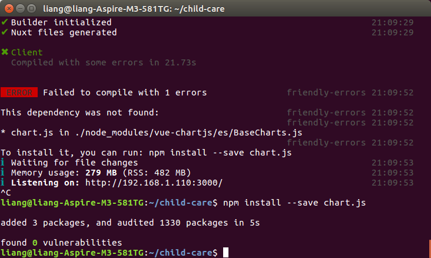
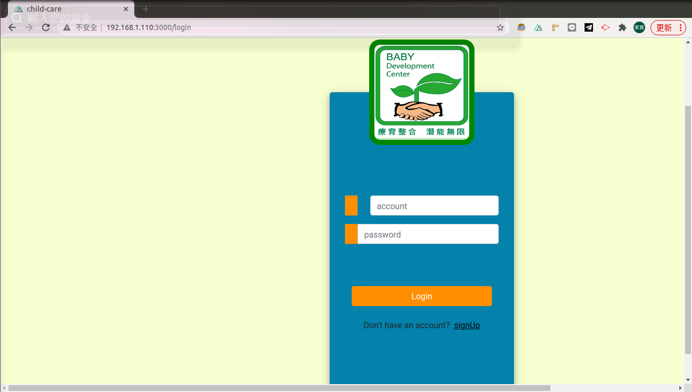

---

typora-copy-images-to: fig
---

# 2021/02/26

## 安裝nvm

參考此網頁https://titangene.github.io/article/nvm.html

## 執行專案

先clone 專案

```
git clone https://gitlab.com/Jia-Yin/child-care.git
```

進入專案資料夾

```
cd child-care
```

第一次跑專案要先安裝套件(之後不需要這個步驟)

```
npm install
```

把網頁跑起來

```
npm run dev
```

### Error : not found chart.js


先用ctrl+c 停止網站

```
Ctrl + c
```


依照提示文字安裝 char.js

```
npm install --save chart.js
```



重新讓網頁跑起來

``` 
npm run dev
```

