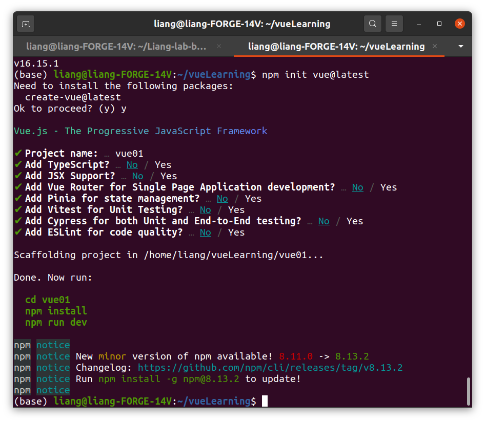

2022/07/08

# Vue-Setup

## node.js  用 16.15.1

切換使用的node版本（小提示，可以用tab補齊版本號）

```
nvm use v15.16.1
```

查看已安裝的node版本

```
node -v
```

查看目前使用的版本

```
nvm current
```

其他細節看這篇

https://hackmd.io/M0lYGCOdSLWR4qEM28A8Lw

## 建立vue的傳案

放在[https://github.com/jcliang7/vueLearning](https://github.com/jcliang7/vueLearning)

```
npm init vue@latest
```

project name : **vue01**

其他都用預設值


